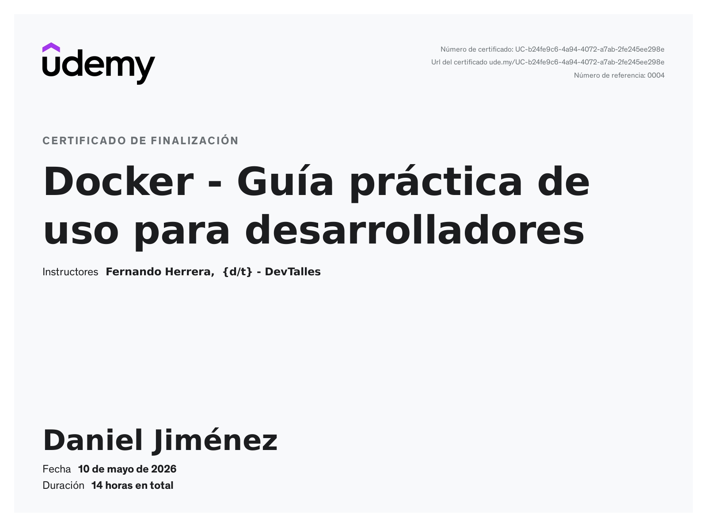
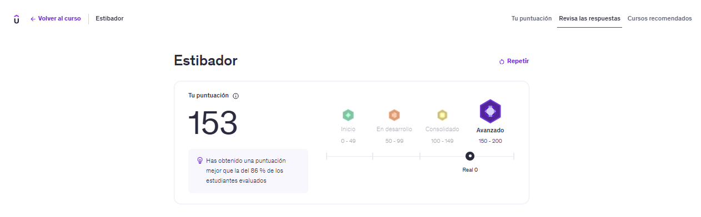

# 🐳 Notas de Estudio: Primeros Pasos con Docker

Este repositorio contiene mis notas de estudio, ejemplos de comandos y documentación práctica generada durante el curso de Docker. Sirve como mi espacio personal para practicar y asentar los conceptos fundamentales de Docker.

## 🙏 Reconocimiento y Fuente del Contenido

El contenido, la estructura de los ejemplos y las buenas prácticas presentadas en este repositorio están **basados en el curso de Udemy: Docker - Guía práctica de uso para desarrolladores**, impartido por **Fernando Herrera**. Todo el mérito por la enseñanza y estructura didáctica es suyo.

## 🗺️ Estructura del Repositorio

El contenido principal está organizado por unidades del curso:

- **[docs/01-bases-de-docker.md](./docs/01-bases-de-docker.md)**: Cubre los conceptos fundamentales, comandos de gestión de contenedores (`run`, `ls`, `rm`, `stop`, `start`) y gestión de imágenes (`pull`, `images`, `rm`).
- **[docs/02-volumenes.md](./docs/02-volumenes.md)**: Explica la persistencia de datos y los tipos de volúmenes (Named, Bind y Anonymous), detallando comandos de gestión (`create`, `ls`, `inspect`) y el uso de rutas absolutas para el desarrollo en tiempo real.
- **[docs/03-redes.md](./docs/03-redes.md)**: Aborda la comunicación entre contenedores y el exterior, cubriendo la creación de redes personalizadas (`create`), la inspección de configuraciones (`inspect`) y la conexión de contenedores específicos (`connect`) para permitir el acceso por nombre de host.
- **[docs/04-docker-compose.md](./docs/04-docker-compose.md)**: Trata la orquestación de aplicaciones multi-contenedor mediante archivos YAML, definiendo servicios, políticas de reinicio (`restart`), dependencias entre contenedores (`depends_on`) y la gestión centralizada de redes y volúmenes externos.
- **[docs/05-dockerfile.md](./docs/05-dockerfile.md)**: Detalla la creación de imágenes personalizadas mediante instrucciones (`FROM`, `WORKDIR`, `RUN`, `CMD`), la optimización de capas mediante caché y el proceso de publicación en Docker Hub junto al uso de .dockerignore.
- **[docs/06-builds.md](./docs/06-builds.md)**: Profundiza en el uso de **Docker Buildx** para la creación de imágenes multiplataforma, gestión de builders y el uso de controladores para compilaciones avanzadas.
- **[docs/07-Versionado-Semantico.md](./docs/07-Versionado-Semantico.md)**: Explica la importancia de la nomenclatura en el etiquetado de imágenes siguiendo el estándar `MAJOR.MINOR.PATCH`, permitiendo una gestión de versiones profesional y predecible.
- **[docs/08-nginx.md](./docs/08-nginx.md)**: Guía práctica sobre el uso de Nginx como servidor web y Proxy Inverso dentro de contenedores, incluyendo configuración de archivos de servidor y exposición de puertos.
- **[docs/09-Orquestadores.md](./docs/09-Orquestadores.md)**: Introducción detallada a **Kubernetes (K8s)** con Minikube. Cubre la creación de Deployments, Services (ClusterIP y NodePort), ConfigMaps y Secrets para una orquestación robusta y escalable.

## 📦 Requisitos Previos

Para seguir y replicar los ejemplos en este repositorio, necesitarás tener instalado lo siguiente:

- **Docker Desktop / Engine:** Para construir y ejecutar contenedores.
- **Docker Buildx:** Para compilaciones multiplataforma.
- **Minikube & kubectl:** Para las prácticas de la sección de orquestadores (Kubernetes).

## 🎓 Certificación y Evaluación

Al finalizar este curso, se consolidaron los conocimientos mediante una evaluación teórica y práctica.

### Certificado de Finalización

### Resultado de la Evaluación

---